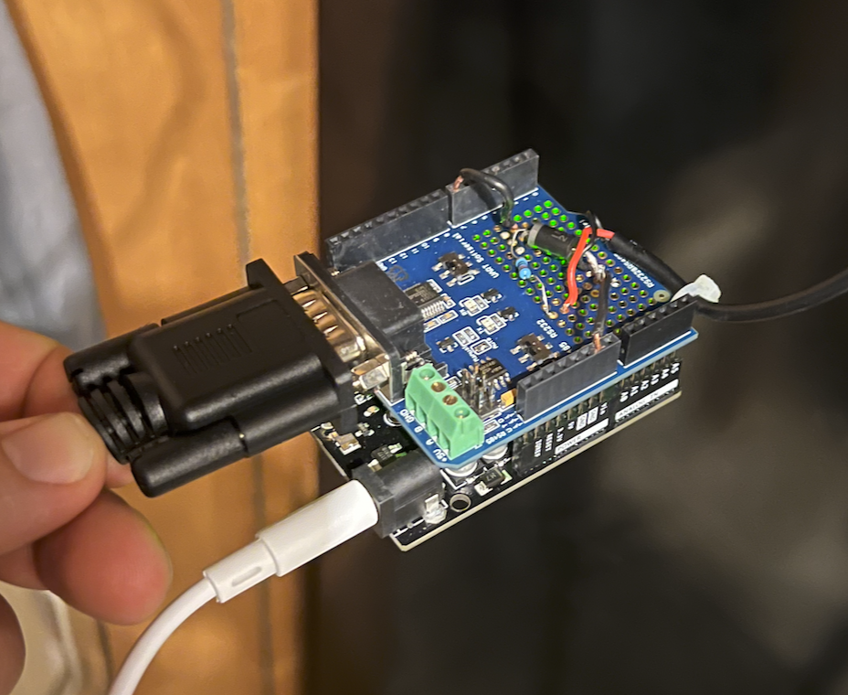

Code and schematics for controlling a Sony brand projector with an Arduino.

# Use cases

- Turn projector on/off automatically with 12v signal from amplifier
  - This is necessary because the projector does not support HDMI-CEC

# Known working models

- VPL-VW295ES

# Materials Needed

- 1x [Arduino UNO R3](https://www.amazon.com/ELEGOO-Board-ATmega328P-ATMEGA16U2-Compliant/dp/B01EWOE0UU/ref=sxts_rp_s_a_1_0?content-id=amzn1.sym.eff26b9b-e255-411b-a40d-eccb21f93fe4%3Aamzn1.sym.eff26b9b-e255-411b-a40d-eccb21f93fe4&crid=1598SI0EQDSPU&cv_ct_cx=arduino+uno&keywords=arduino+uno&pd_rd_i=B01EWOE0UU&pd_rd_r=a9415f72-fa90-4607-bdc8-932cb17fc034&pd_rd_w=hMHov&pd_rd_wg=MC7Uj&pf_rd_p=eff26b9b-e255-411b-a40d-eccb21f93fe4&pf_rd_r=JDFF7GSGE2EBQNQWB4VZ&qid=1677335223&sprefix=arduino+uno%2Caps%2C65&sr=1-1-5985efba-8948-4f09-9122-d605505c9d1e) (or equivalent)
- 1x [Arduino RS232 Serial Shield](https://www.amazon.com/dp/B00N4MKVFK?psc=1&ref=ppx_yo2ov_dt_b_product_details) (or equivalent)
- 1x [Straight through Serial Cable](https://www.amazon.com/Serial-Extension-Female-Straight-Through/dp/B07B4T699J/ref=sr_1_3?crid=4PB6KDXXOO9T&keywords=rs232+cable&qid=1677337188&sprefix=rs232+cable+%2Caps%2C64&sr=8-3)
  - Your projector may require a different cable.
- 1x [30k Ohm resistor](https://www.amazon.com/dp/B008UFWHL2?psc=1&ref=ppx_yo2ov_dt_b_product_details)
- 1x [1N5338B Zener Diode](https://www.amazon.com/dp/B008UFWHL2?psc=1&ref=ppx_yo2ov_dt_b_product_details)
- 1x [1/8" Mono Plug to Bare Wire cable](https://www.amazon.com/dp/B08Q7CYHZC?psc=1&ref=ppx_yo2ov_dt_b_product_details) (or just cut one you have)

# How to Use

1. Purchase the materials listed above
2. Soldier the components to the Arduino RS232 Serial Shield using the wiring diagram below
3. Upload the code to the Arduino
4. Connect the Arduino to the projector using the serial cable
5. Connect the Amplifier to the Arduino using the 1/8" Mono Plug to Bare Wire cable
6. Configure the amplifier to send a 12v signal to the Arduino when the amplifier is turned on

# Wiring Diagrams

# Troubleshooting

- Upon reset/startup - the Arduino will read the amplifiers 12v output, but will not send a command to the projector. This is to ensure the projector isn't randomly turned on or off when the Arduino is reset. You must toggle the amplifiers state to turn the projector on or off after Arduino reset/startup.

- The green light on the Arduino will turn on when the amplifier is turned on

- My Sony projector requires 38400 baud rate with 8 bits, 1 stop bit, and even parity. Yours may be different (though not likely)

- You must use the UART serial output on the Arduino - as SoftwareSerial does not support parity

- I used a straight through cable linked above. There is a chance some projectors require a crossover cable/adapter.
